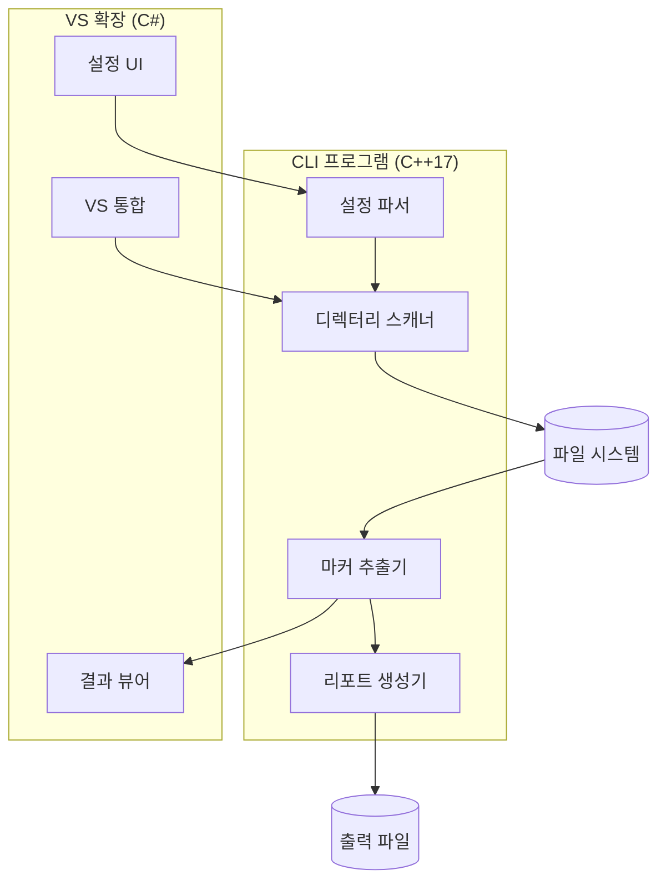
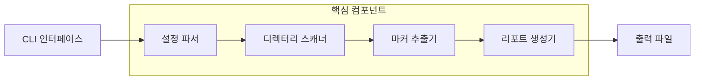
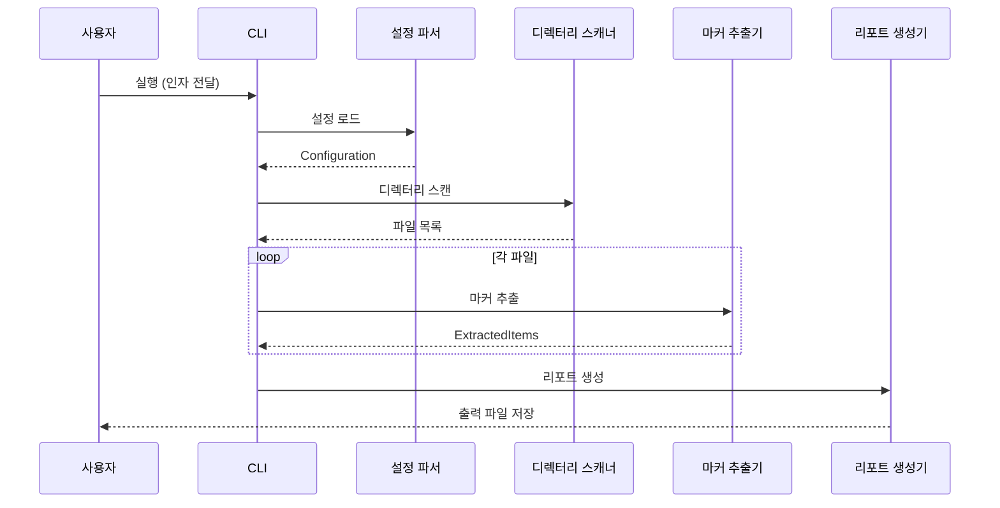
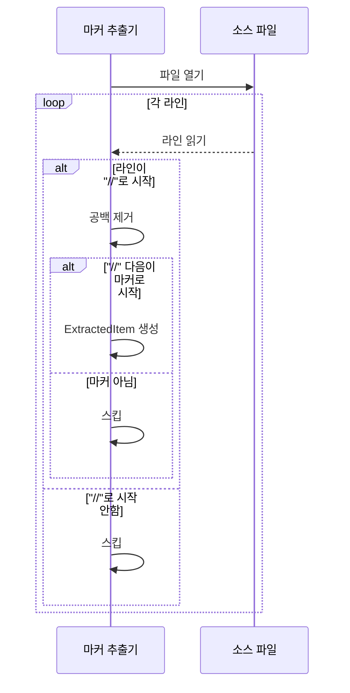

# Todo Extractor 아키텍처 문서

## 1. 소개

이 문서는 Todo Extractor의 전체 프로젝트 아키텍처를 설명합니다. CLI 프로그램과 Visual Studio 확장 컴포넌트를 포함하며, 개발 시 일관성과 선택된 패턴 및 기술 준수를 보장하기 위한 아키텍처 청사진 역할을 합니다.

### 1.1 스타터 템플릿 또는 기존 프로젝트

해당 없음 - 이 프로젝트는 처음부터 새로 개발됩니다.

### 1.2 변경 이력

| 날짜 | 버전 | 설명 | 작성자 |
|------|------|------|--------|
| 2024-01-01 | 1.0 | 최초 아키텍처 문서 작성 | 아키텍트 |

---

## 2. 상위 수준 아키텍처

### 2.1 기술 요약

Todo Extractor는 두 개의 독립적인 컴포넌트로 구성된 데스크톱 도구입니다:
1. **CLI 프로그램**: C++17 표준 라이브러리만 사용하여 개발된 크로스 플랫폼 명령줄 도구
2. **Visual Studio 확장**: C#으로 개발된 VS 2022 확장 프로그램

시스템은 파일 시스템 스캐너, 마커 추출 엔진, 리포트 생성기의 세 가지 핵심 컴포넌트로 구성됩니다. 이 아키텍처는 PRD의 목표인 단순성, 외부 의존성 없음, 1일 개발 범위를 지원합니다.

### 2.2 상위 수준 개요

**아키텍처 스타일**: Monolithic - 단일 실행 파일로 모든 기능 포함

**저장소 구조**: Monorepo - CLI와 VS 확장을 하나의 저장소에서 관리

**서비스 아키텍처**:
- CLI: 단일 실행 파일 (Windows exe)
- VS 확장: VSIX 패키지

**주요 데이터 흐름**:
```
[설정 로드] → [디렉터리 스캔] → [파일 파싱] → [마커 추출] → [결과 집계] → [리포트 생성]
```

### 2.3 상위 수준 프로젝트 다이어그램



### 2.4 아키텍처 및 설계 패턴

- **파이프라인 패턴**: 데이터가 순차적으로 처리 단계를 통과 - _근거:_ 각 단계의 독립성 보장 및 테스트 용이성
- **전략 패턴**: 출력 형식(MD/CSV/JSON)별 리포터 구현 - _근거:_ 새로운 출력 형식 추가 용이
- **싱글톤 패턴**: 설정 관리자 - _근거:_ 전역 설정에 대한 단일 접근점 제공

---

## 3. 기술 스택

### 3.1 기술 스택 테이블

| 분류 | 기술 | 버전 | 용도 | 근거 |
|------|------|------|------|------|
| **언어 (CLI)** | C++ | 17 | CLI 프로그램 개발 | PRD 요구사항, 표준 라이브러리만 사용 |
| **언어 (VS 확장)** | C# | 10.0 | VS 확장 개발 | VS 확장 SDK 표준 언어 |
| **빌드 (CLI)** | CMake | 3.20+ | CLI 빌드 시스템 | 크로스 플랫폼 빌드 지원 |
| **빌드 (VS 확장)** | MSBuild | 17.0 | VS 확장 빌드 | VS 2022 표준 빌드 시스템 |
| **IDE** | Visual Studio | 2022 | 개발 환경 | 타겟 플랫폼 |
| **버전 관리** | Git | 2.40+ | 버전 관리 | 업계 표준 |
| **설정 형식** | JSON | - | 설정 파일 형식 | 가독성, 파싱 용이성 |

---

## 4. 데이터 모델

### 4.1 ExtractedItem (추출된 항목)

**목적**: 코드에서 추출된 단일 마커 항목을 표현

**주요 속성:**
- `filePath`: string - 소스 파일의 상대 경로
- `lineNumber`: int - 마커가 발견된 라인 번호
- `markerType`: string - 마커 유형 (예: TODO, FIXME)
- `content`: string - 마커 이후의 주석 내용
- `fullLine`: string - 전체 라인 텍스트

**관계:**
- ExtractedItem은 단일 ScanResult에 속함

### 4.2 ScanResult (스캔 결과)

**목적**: 전체 스캔 작업의 결과를 집계

**주요 속성:**
- `items`: vector<ExtractedItem> - 추출된 모든 항목
- `scannedFiles`: int - 스캔된 파일 수
- `totalMatches`: int - 총 매칭 수
- `scanDuration`: duration - 스캔 소요 시간
- `markerCounts`: map<string, int> - 마커별 개수

**관계:**
- 여러 ExtractedItem을 포함

### 4.3 Configuration (설정)

**목적**: 스캔 및 추출 동작 설정

**주요 속성:**
- `markers`: vector<string> - 추출할 마커 목록 (예: ["TODO:", "FIXME:", "!"])
- `extensions`: vector<string> - 스캔할 파일 확장자
- `excludeDirs`: vector<string> - 제외할 디렉터리
- `outputFormat`: string - 출력 형식 (md/csv/json)
- `outputPath`: string - 출력 파일 경로

**관계:**
- Scanner와 Extractor가 Configuration을 참조

---

## 5. 컴포넌트

### 5.1 ConfigParser (설정 파서)

**책임**: JSON 설정 파일을 읽고 파싱하여 Configuration 객체 생성

**주요 인터페이스:**
- `Configuration loadConfig(const string& path)`
- `Configuration getDefaultConfig()`
- `void mergeWithArgs(Configuration& config, const Args& args)`

**의존성**: 표준 라이브러리 (fstream, string)

**기술 스택**: C++17 std::filesystem, 자체 JSON 파서

### 5.2 DirectoryScanner (디렉터리 스캐너)

**책임**: 지정된 디렉터리를 재귀적으로 스캔하여 대상 파일 목록 생성

**주요 인터페이스:**
- `vector<path> scan(const path& root, const Configuration& config)`
- `bool shouldInclude(const path& file, const Configuration& config)`
- `bool shouldExclude(const path& dir, const Configuration& config)`

**의존성**: ConfigParser

**기술 스택**: C++17 std::filesystem

### 5.3 MarkerExtractor (마커 추출기)

**책임**: 소스 파일을 분석하여 `//마커`로 시작하는 주석 라인 추출

**주요 인터페이스:**
- `vector<ExtractedItem> extract(const path& file, const Configuration& config)`
- `bool isMarkerLine(const string& line, const vector<string>& markers)`
- `ExtractedItem parseLine(const string& line, int lineNum, const path& file)`

**의존성**: ConfigParser

**기술 스택**: C++17 string, regex

### 5.4 ReportGenerator (리포트 생성기)

**책임**: 추출 결과를 지정된 형식(MD/CSV/JSON)으로 출력

**주요 인터페이스:**
- `void generate(const ScanResult& result, const Configuration& config)`
- `string toMarkdown(const ScanResult& result)`
- `string toCSV(const ScanResult& result)`
- `string toJSON(const ScanResult& result)`

**의존성**: MarkerExtractor 결과

**기술 스택**: C++17 string, fstream

### 5.5 컴포넌트 다이어그램



---

## 6. 핵심 워크플로우

### 6.1 CLI 실행 워크플로우



### 6.2 마커 추출 상세 워크플로우



---

## 7. 소스 트리

```plaintext
todo-extractor/
├── CMakeLists.txt              # 루트 CMake 설정
├── README.md                   # 프로젝트 설명
├── LICENSE                     # MIT 라이선스
│
├── cli/                        # CLI 프로그램
│   ├── CMakeLists.txt
│   ├── src/
│   │   ├── main.cpp           # 진입점
│   │   ├── config_parser.cpp   # 설정 파서
│   │   ├── config_parser.h
│   │   ├── directory_scanner.cpp
│   │   ├── directory_scanner.h
│   │   ├── marker_extractor.cpp
│   │   ├── marker_extractor.h
│   │   ├── report_generator.cpp
│   │   ├── report_generator.h
│   │   └── types.h            # 공통 타입 정의
│   └── tests/
│       ├── test_config_parser.cpp
│       ├── test_directory_scanner.cpp
│       ├── test_marker_extractor.cpp
│       └── test_report_generator.cpp
│
├── vs-extension/               # Visual Studio 확장
│   ├── TodoExtractor.sln
│   ├── TodoExtractor/
│   │   ├── TodoExtractor.csproj
│   │   ├── source.extension.vsixmanifest
│   │   ├── Commands/
│   │   │   └── ScanCommand.cs
│   │   ├── Dialogs/
│   │   │   └── SettingsDialog.xaml
│   │   ├── Models/
│   │   │   └── ExtractedItem.cs
│   │   └── Services/
│   │       └── ExtractorService.cs
│   └── TodoExtractor.Tests/
│
├── config/                     # 기본 설정 파일
│   └── default-config.json
│
└── docs/                       # 문서
    ├── prd.md
    └── architecture.md
```

---

## 8. 코딩 표준

### 8.1 핵심 표준

- **언어 및 런타임**: C++17 (CLI), C# 10.0 (VS 확장)
- **스타일 및 린팅**: clang-format (Google style), .editorconfig
- **테스트 구성**: tests/ 디렉터리에 소스 파일과 1:1 대응

### 8.2 명명 규칙

| 요소 | 규칙 | 예시 |
|------|------|------|
| 클래스 | PascalCase | `MarkerExtractor` |
| 함수 | camelCase | `extractMarkers()` |
| 변수 | camelCase | `lineNumber` |
| 상수 | UPPER_SNAKE | `DEFAULT_MARKERS` |
| 파일 | snake_case | `marker_extractor.cpp` |

### 8.3 중요 규칙

- **마커 매칭 규칙**: `//`로 시작하는 라인에서만 마커 추출. 단순 포함이 아닌 `//마커`로 시작해야 함
- **공백 처리**: `//TODO:`, `// TODO:`, `//  TODO:` 모두 동일하게 처리
- **경로 처리**: 항상 상대 경로로 출력, 경로 구분자는 `/` 사용
- **인코딩**: 모든 파일 UTF-8로 처리
- **외부 의존성 금지**: CLI는 C++17 표준 라이브러리만 사용

---

## 9. 테스트 전략 및 표준

### 9.1 테스트 철학

- **접근 방식**: Test-after (MVP 우선 개발)
- **커버리지 목표**: 핵심 로직 80% 이상
- **테스트 피라미드**: Unit 80%, Integration 20%

### 9.2 유닛 테스트

- **프레임워크**: Google Test (CLI), MSTest (VS 확장)
- **파일 규칙**: `test_*.cpp`
- **위치**: `cli/tests/`, `vs-extension/TodoExtractor.Tests/`

**주요 테스트 케이스**:
1. 마커 추출 정확성 (`//TODO:` vs `// TODO:` vs `TODO:`)
2. 제외 디렉터리 처리
3. 파일 확장자 필터링
4. 출력 형식 생성

---

## 10. 마커 추출 알고리즘

### 10.1 핵심 알고리즘

```cpp
bool isMarkerLine(const string& line, const vector<string>& markers) {
    // 1. 앞쪽 공백 제거
    string trimmed = ltrim(line);

    // 2. "//"로 시작하는지 확인
    if (!startsWith(trimmed, "//")) {
        return false;
    }

    // 3. "//" 이후 문자열 추출
    string afterSlash = trimmed.substr(2);

    // 4. 선택적 공백 제거
    string content = ltrim(afterSlash);

    // 5. 마커로 시작하는지 확인
    for (const auto& marker : markers) {
        if (startsWith(content, marker)) {
            return true;
        }
    }

    return false;
}
```

### 10.2 마커 매칭 예시

| 라인 | 마커: `TODO:` | 결과 |
|------|--------------|------|
| `//TODO: 나중에 수정` | 매칭 | 추출됨 |
| `// TODO: 나중에 수정` | 매칭 | 추출됨 |
| `//  TODO: 나중에 수정` | 매칭 | 추출됨 |
| `// 이것은 TODO: 가 아님` | 비매칭 | 스킵 |
| `/* TODO: 블록 주석 */` | 비매칭 | 스킵 |
| `int x = 1; // TODO: 인라인` | 비매칭 | 스킵 |

### 10.3 다중 마커 지원

설정 파일에서 배열로 여러 마커 정의:

```json
{
  "markers": ["TODO:", "FIXME:", "HACK:", "XXX:", "BUG:", "!"]
}
```

`!` 마커의 경우:
- `//! 중요한 내용` → 추출됨
- `// !중요한 내용` → 추출됨
- `int x = 1; //! 인라인` → 스킵

---

## 11. 기본 설정

```json
{
  "markers": ["TODO:", "FIXME:", "HACK:", "XXX:", "BUG:"],
  "extensions": [".cpp", ".h", ".hpp", ".c", ".cs", ".py", ".js", ".ts"],
  "excludeDirs": ["node_modules", ".git", "bin", "obj", "build", "out"],
  "outputFormat": "md",
  "outputPath": "todo-report.md"
}
```

---

## 12. 다음 단계

### 12.1 개발 순서

1. **에픽 1**: CLI 핵심 기능 개발
   - 스토리 1.1~1.7 순차 진행

2. **에픽 2**: VS 확장 개발
   - CLI 완성 후 진행

### 12.2 개발 에이전트 프롬프트

이 아키텍처 문서와 PRD를 기반으로 Todo Extractor CLI 프로그램을 개발해 주세요. 에픽 1의 스토리를 순서대로 구현하고, 특히 마커 추출 알고리즘(섹션 10)을 정확히 구현해 주세요.
